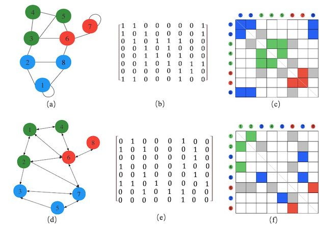

**[Adjacency matrix](http://en.wikipedia.org/wiki/Adjacency_matrix)** for quick exploring patterns in mineral data. 

- The layout of an adjacency matrix is visualized as a table where the lines and columns are vertices of a graph and, when two vertices are connected, the cell at the intersection is displayed using a contrasted color ([Fekete, 2009](https://doi.org/10.1109/CADCG.2009.5246813))

- Cells of the adjacency matrix represent edges, their source and target nodes arranged along the x and y axes.

- For the undirected graph, such as `(a)`, the adjacency matrix is symmetric, while for directed graph, such as `(d)`, it is most likely not. `(b)` and `(e)` show the show the numeric value of adjacency matrices corresponding to `(a)` and ` (d)` respectively. `(c)` and `(f)` are the visualizations based on these two adjacency matrices in `(b)` and `(e)` respectively, where the round nodes of different colors indicate that they belong to different communities (generated by a specified detection algorithm in the graph), and different cell colors indicate different types of connections (edges) between the nodes. 

- Different cell colors indicate different types of connections (edges) between the nodes. The cell’s colo matches the node’s color if the edge is within a community, the color is gray if the edge it is between communities, and is white if the edge does not exist. This adjacency matrix-based visualization can be easily rearranged according to the nodes’ community, name, and some other relevant attributes in the graph, and is an effective way to facilitate data science discoveries. 

- The value of the elements of the numeric matrix is 1 when there is an edge from vertex i to vertex j, and is 0 when there is no edge ([Biggs et al., 1993](https://books.google.com/books?hl=en&lr=&id=6TasRmIFOxQC&oi=fnd&pg=PP9&dq=Biggs,+N.,+Biggs,+N.L.,+Norman,+B.,+1993.+Algebraic+Graph+Theory+(2nd+Edition).+Cambridge+University+Press,+New+York&ots=lWp1YWThfm&sig=25JmpEqu4gHlA4IFxWkbWY8fJCc)), which indicate whether pairs of vertices are adjacent or not in the graph. 

- To better understand the rearrangements and pattern analyses of the adjacency matrix, here is a brief list of several concepts. The “Degree” of a node in an adjacency matrix is the number of edges connected with the node ([Diestel, 2017](https://doi.org/10.1007/978-3-662-53622-3_3)). The “Betweenness” is widely used in network analysis, which represents the degree to which nodes stand between each other ([Freeman , 2002](https://books.google.com/books?hl=en&lr=&id=fy3m_EixWOsC&oi=fnd&pg=PA238&dq=Freeman,+L.C.,+2002.+Centrality+in+social+networks:+Conceptual+clarification.+In:+Scott,+J.+(ed.)+Social+Network:+Critical+Concepts+in+Sociology.+Routledge,+New+York,+pp.238-263&ots=umL9JCK5XZ&sig=6iL_fqhDGppI-lzOJRa_HjlyZKs)). The “Closeness” of a node is a measure of centrality in a network, calculated from the reciprocal of the sum of the length of the shortest paths between one node and all the other nodes in the graph. Thus, the more central a node is, the closer it is to all other nodes ([Bavelas , 1950](https://books.google.com/books?hl=en&lr=&id=czdxDwAAQBAJ&oi=fnd&pg=PA35&dq=Bavelas,+A.,+1950.+Communication+Patterns+in+Task-Oriented+Groups.+Journal+of+the+Acoustical+Society+of+America+22+(6),+725%E2%80%93730&ots=k0Gtz_PDaj&sig=BiyRBa9WH-MtHtfmqITyiJQxKy4)). The eigenvalues of a graph are the eigenvalues of its adjacency matrix, which characterize the topological structure of the graph ([Cvetković et al., 1995](https://www.cambridge.org/core/journals/proceedings-of-the-edinburgh-mathematical-society/article/cvetkovid-m-doobm-and-sachshspectra-of-graphs-3rd-edition-johann-ambrosius-barth-verlag-heidelberg-leipzig1995-447-pp-3-335-00407-8-dm-168/20DC65316D0A518FACE85E064F5C4215); [Farkas et al., 2002](https://doi.org/10.1016/S0378-4371(02)01181-0)).

 

- UseCase datasets are current retrieved from the **[Mindat database](https://www.mindat.org/)**, **[RRUFF database](https://rruff.info/)** (including **[rruff.info/evolution](https://rruff.info/evolution/)**  and  **[rruff.info/ima](https://rruff.info/ima/))**. In the future, the datasets should be able to automatically updated according to the **[mindat API](https://api.mindat.org/)**.

- Some of the datasets have weigted edges - you may optionally set the alpha level of the plot to correspond to these weights.

- For two big datasets use cases, we integrated the **[Interactive Periodic Table in JavaScript version 1.0](https://www.codedrome.com/interactive-periodic-table-in-javascript/)** into our shiny application to organize and quickly display the adjacency matrix by selecting chemical elements. 

